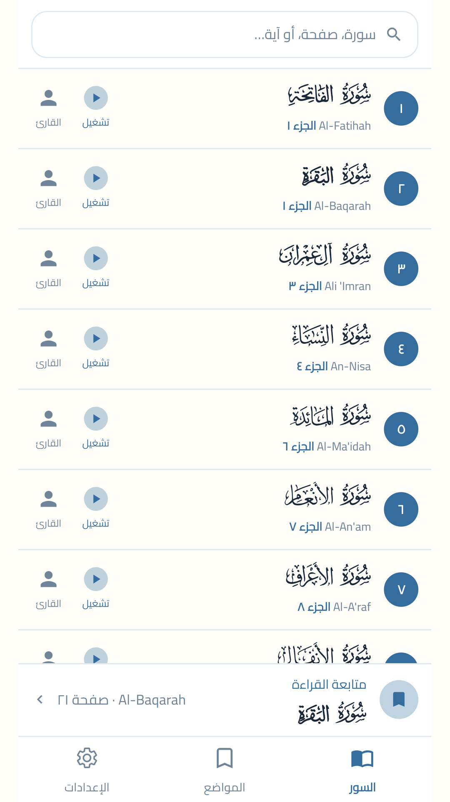
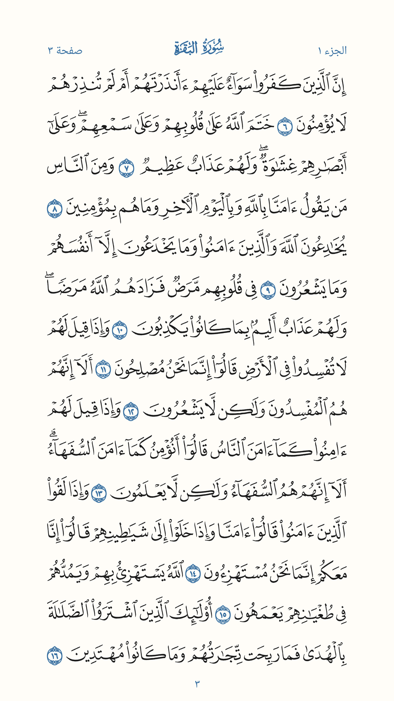
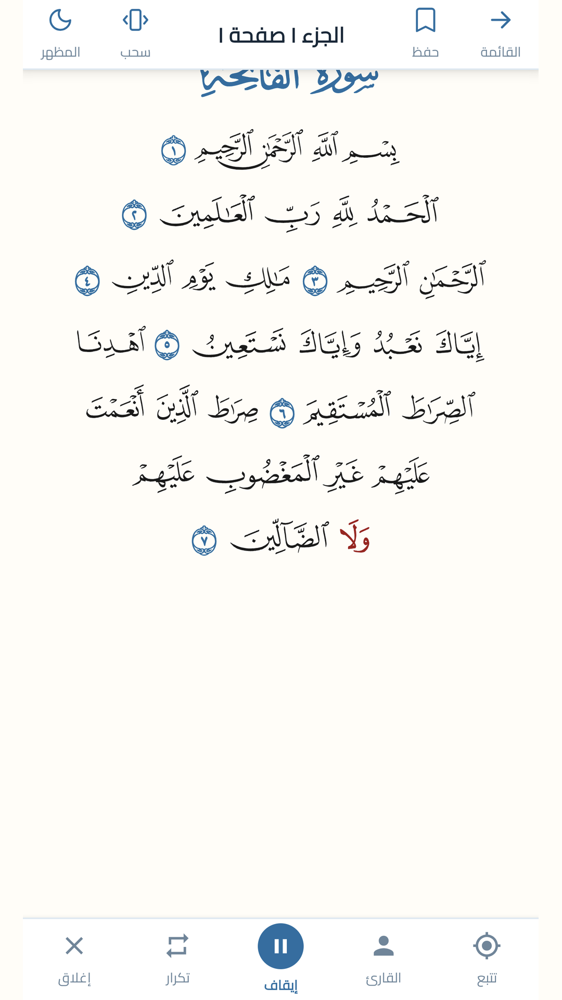
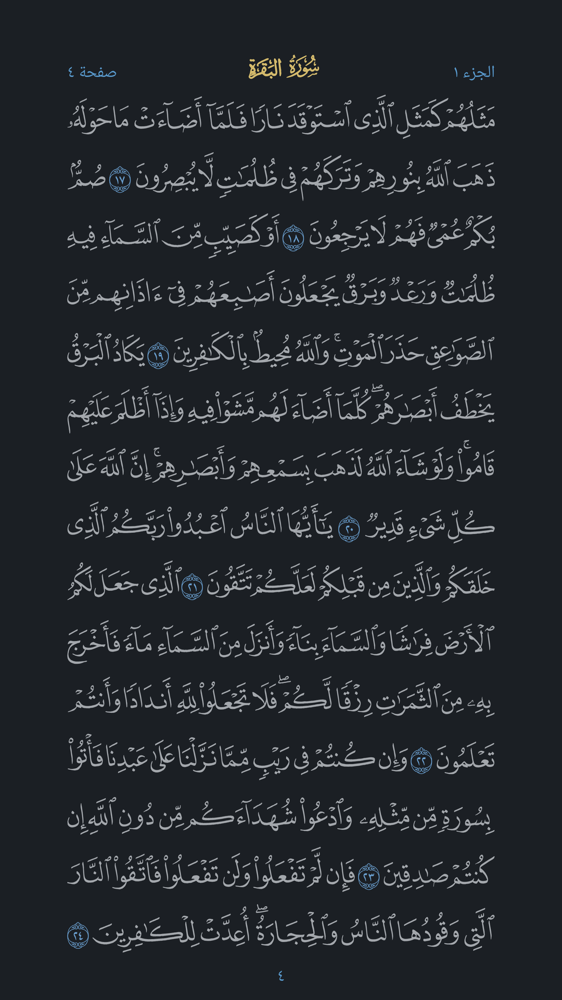
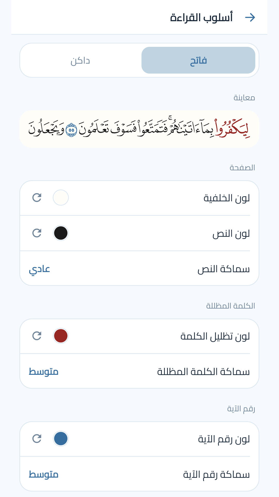

# القرآن العظيم · The Great Quran

The Madinah Mushaf on Android, drawn page by page as it is printed, with recitation that follows the words.

Native Kotlin and Android Views, no web view. The pages are drawn from the mushaf's own fonts, so the type is as sharp as the screen allows and nothing reflows. A companion of [readqurantoday.com](https://readqurantoday.com).

<p>
  
  
  
  
  
</p>

## What it does

**Reading**
- All 604 pages exactly as printed, one page per screen.
- Turn by sliding the page, or by tipping it over like paper — your choice in settings.
- Pinch to zoom in on a line; let go part-way back and the page settles to full size.
- Tap once for the menus, tap again to send them away; they also leave when you turn the page.
- Saved pages, recently read surahs, and a card that takes you back where you left off.

**Recitation**
- Five reciters, with the word being recited lit on the page as it is read.
- Hold a word to start from it, or play a whole surah or juz.
- Repeat an ayah, a page, or a surah.
- Keeps playing with the screen off, with full controls in the notification shade and on the lock screen: previous and next ayah, seek, pause, close.

**Finding your place**
- Search by surah name, page number, or a word from an ayah.
- The full surah list, and the thirty juz, each opening — or reciting — from its first ayah.

**Making it yours**
- Light and dark, or follow the phone.
- Page colour, text colour, and the colour of the ayah and page numbers.
- Text weight for the words, the numbers and the highlight.
- Arabic and English interface.

**Offline**
- The whole mushaf is inside the app: no download on first open, and no network to read.
- Recitations stream, or download for listening offline, and can be copied to the phone's Download folder to play anywhere.

## Built from

- **Text and glyph layout**: the KFGQPC Madinah Mushaf fonts, one per page, laid out line by line and fitted to the sheet.
- **Ayah text and search**: the Tanzil Quran text (CC BY 3.0), used unmodified.
- **Audio**: recitations served from the project's own CDN, with word timings per reciter.
- **Libraries**: AndroidX, Media3 (ExoPlayer) for playback, and a colour picker. No analytics, no ads, no accounts.

## Building

Open the project in Android Studio and run. Everything the app reads is in `app/src/main/assets`, so there is nothing to fetch first.

- minSdk 24, target 36.
- Release steps, signing and versioning: [docs/RELEASE.md](docs/RELEASE.md).
- Play Console answers and store text: [docs/PLAY_STORE.md](docs/PLAY_STORE.md).
- House rules for the code and the design: [CLAUDE.md](CLAUDE.md).

Store art is generated from the app's own icon paths:

```bash
python tools/render_store_art.py
```

## Privacy

Nothing leaves the phone unless you send it. Reading position, bookmarks and settings stay on the device; a report you choose to send from Settings carries your message and the app and device details, and nothing else. Full text: [readqurantoday.com/privacy](https://readqurantoday.com/privacy/).
